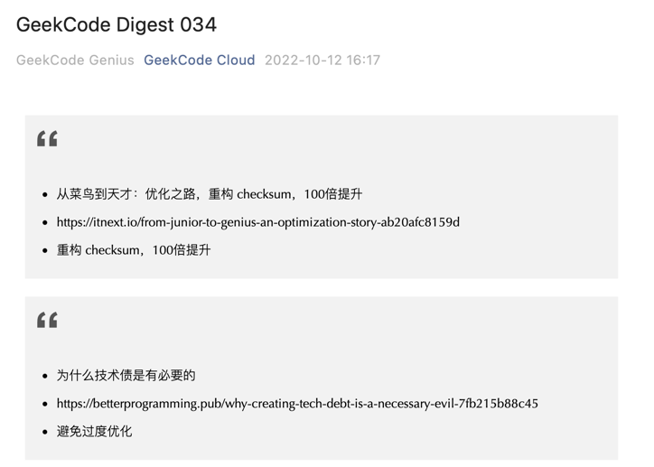

# GeekCode Daily Digest

GeekCode 每日更新技术简报

## edit markdown post

```bash
cd ./blog/_posts
vim new-post.md
```

## post markdown template

```markdown
title: GeekCode Digest 034
date: 2022-10-11
gen_cover: img/digest-header.png
subtitle: 从菜鸟到天才：优化之路，重构 checksum，100倍提升; 为什么技术债是有必要的; 使用AWS CodePipeline和Elastic
Beanstalk部署GPT-3 Flask 应用程序
---

GeekCode Digest 034
---

## subtitle

* list
* list
```

## run sync script

```bash
export WECHAT_APP_ID=your_wechat_app_id
export WECHAT_APP_SECRET=your_wechat_app_secret
make init
make start
```

OR Docker

```bash
docker build -t geekcode-digest .
docker run -e WECHAT_APP_ID=your_wechat_app_id -e WECHAT_APP_SECRET=your_wechat_app_secret  geekcode-digest:latest
```

## open wechat draft

